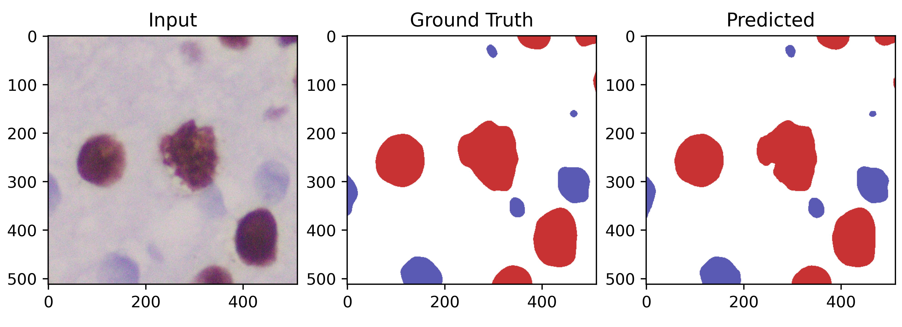

# Bladder-cancer-segmentation

## Problem Statement
Ki-67 index is a widely used proliferation index to predict the aggresiveness of cancer. Computing this value is time consuming as pathologists have to manually count the tumour nuclei.
We automate this process by using deep learning to segment immmonupositive (red) and immunonegative (blue) cells. 

## Architecture Details

## Implementation
## Data

## Results
  

<table>
  <thead>
    <tr>
      <th>Dataset</th><th>Loss</th><th colspan=2>Dice</th><th colspan=2>IoU</th>
    </tr>
  </thead>
  <tbody>
    <tr align="center">
      <td></td><td></td><td>With  background</td><td>Without  background</td><td>With  background</td><td>Without  background</td>
    </tr>
    <tr align="center">
      <td>Train</td>
      <td>0.1747</td> <td>0.9741</td> <td>0.9270</td> <td>0.9510</td> <td>0.8702</td>
    </tr>
    <tr align="center">
      <td>Val</td> <td>0.1806</td> <td>0.9717</td> <td>0.9218</td> <td>0.9461</td> <td>0.8614</td>
    </tr>
    <tr align="center">
      <td>Test</td>
      <td>0.1881</td> <td>0.9733</td> <td>0.9203</td> <td>0.9494</td> <td>0.8618</td>
    </tr>
  </tbody>
</table>

<table>
  <thead>
    <tr>
      <th>Dataset</th><th>Loss</th><th colspan=2>Dice</th><th colspan=2>IoU</th>
    </tr>
  </thead>
  <tbody>
    <tr align="center">
      <td></td><td></td><td>With  background</td><td>Without  background</td><td>With  background</td><td>Without  background</td>
    </tr>
    <tr align="center">
      <td>Train</td>
      <td>0.1747</td> <td>0.8267</td> <td>0.7552</td> <td>0.7906</td> <td>0.7067</td>
    </tr>
    <tr align="center">
      <td>Val</td> <td>0.1806</td> <td>0.8163</td> <td>0.7333</td> <td>0.7777</td> <td>0.6835</td>
    </tr>
    <tr align="center">
      <td>Test</td>
      <td>0.1881</td> <td>0.8266</t> <td>0.7481</td> <td>0.7896</td> <td>0.7001</td>
    </tr>
  </tbody>
</table>

## System requirements
- Python 3
- Keras >=2.0
- Tensorflow >=2.0
